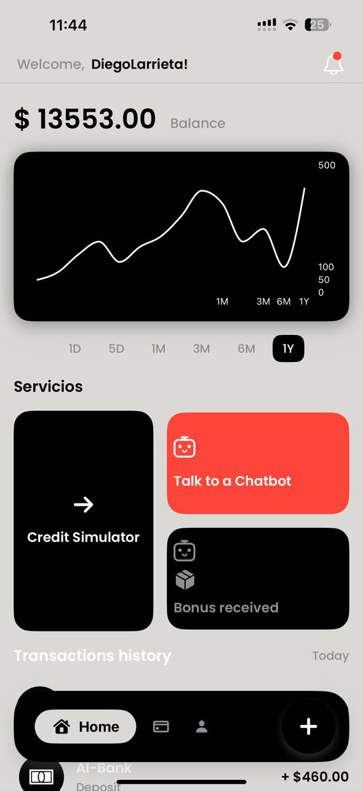
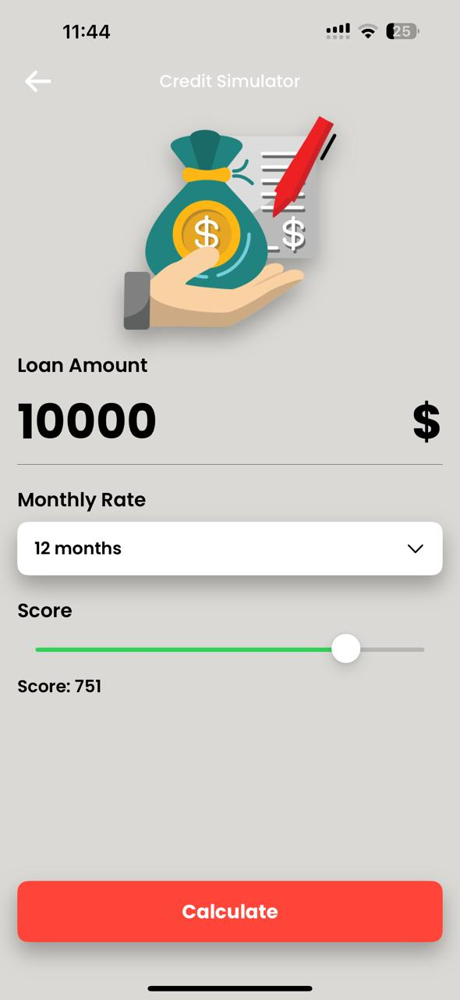
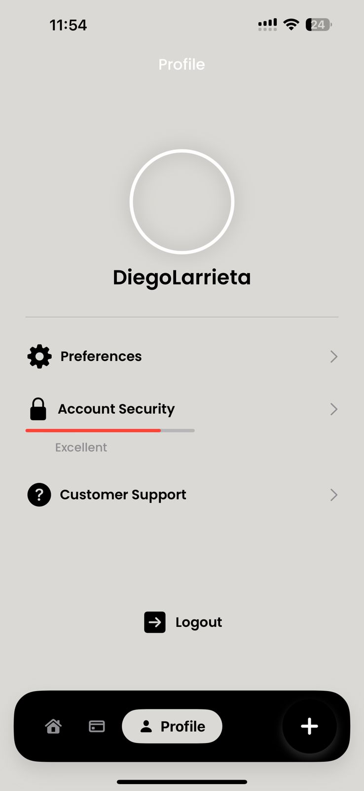
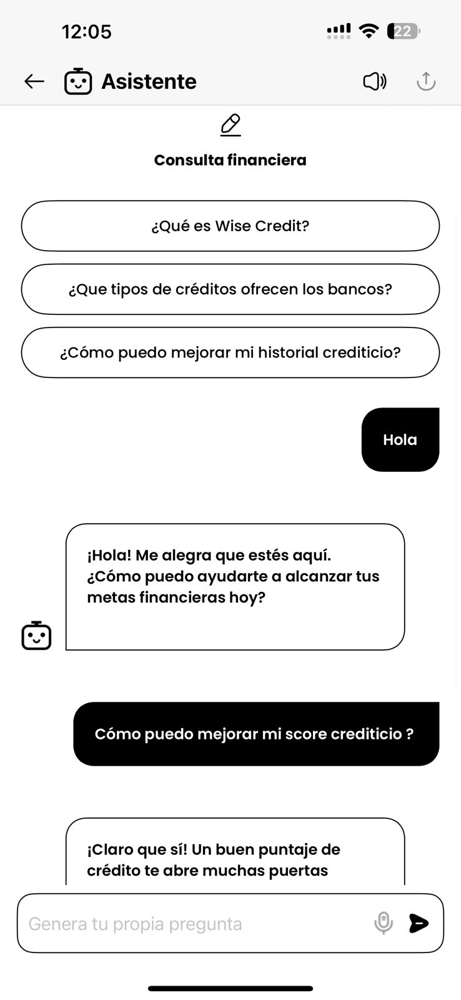

# WiseCredit App

Welcome to the WiseCredit App repository! This project is an innovative financial application designed to help users track their expenses, compare credit options, and stay informed about important updates in the financial world, all while utilizing the latest technologies such as Firebase, Google AI's generative APIs, and a personalized chatbot for customer support.

## Table of Contents
- [About the Project](#about-the-project)
- [Images](#screenshotsapp)
- [Features](#features)
  - [User Features](#user-features)
  - [Admin Features](#admin-features)
- [How We Built It](#how-we-built-it)
- [Challenges We Ran Into](#challenges-we-ran-into)
- [Accomplishments That We're Proud Of](#accomplishments-that-were-proud-of)
- [What We Learned](#what-we-learned)
- [What's Next for WiseCredit](#whats-next-for-wisecredit)
- [Inspiration](#inspiration)
- [Setup & Installation](#setup--installation)
- [Contributing](#contributing)
- [License](#license)

---

## About the Project

WiseCredit is an iOS financial application aimed at simplifying personal finance management while giving users the tools to make better-informed credit decisions. The app integrates features like real-time credit comparison, chatbot support, and notifications about changes in bank rates, all powered by Firebase for backend management and Google AI's generative models for smart assistance. Our focus is to provide an intuitive and user-friendly interface, offering relevant financial insights to help people manage their finances effectively.

---
## screenshotsapp

Here are some screenshots of the WiseCredit App:

### SignUp


### Home Screen


### Credit Simulator



### Profile Management


### Chatbot AI


### Notifications

---


## Features

### User Features

- **Track Expenses:** Users can add, edit, and delete their expenses, categorized under various financial labels like "Food", "Transport", etc.
- **Credit Simulator:** Compare banks and see which one provides the best credit conditions based on the user's credit score, loan amount, and repayment period. The app dynamically calculates the **CAT (Costo Anual Total)**, interest rates, and monthly payments for each bank.
- **Profile Management:** Users can view and update their profile details, including their username and other account preferences.
- **Notifications:** Real-time notifications about important financial updates, such as changes in bank interest rates or special offers.
- **Chatbot Support:** A personalized AI-driven chatbot helps users with frequently asked questions and provides recommendations for credit and financial queries. The chatbot can also escalate the conversation to human support if needed.
- **Visual Dashboard:** Track balances and expenses visually through an integrated graph and budget tracker. This dashboard makes it easy for users to get an overview of their financial status at a glance.

### Admin Features

- **Admin Dashboard:** Admins can manage financial data such as updating interest rates, adding new banks, and monitoring financial simulations for different loan options.
- **Bank Management:** Admins can add and remove banks, upload bank logos, and edit the loan rates and fees for each bank through the admin interface.
- **Notifications for Clients:** Admins can send notifications to users about changes in bank rates or special offers using Firebase Cloud Messaging. These notifications are then displayed in the user’s notifications tab in real time.
- **Track Bank Data:** Admins can see which banks are most favorable for users at a given time based on real-time data.

---

## How We Built It

### Technologies Used
- **Frontend:**
  - SwiftUI for the user interface.
  - Custom components for card layouts, buttons, and profile pages.
  - AsyncImage for fetching and displaying bank logos.
  
- **Backend:**
  - **Firebase** for user authentication, Firestore database, and real-time data updates.
  - **Firebase Firestore** for managing user data and bank loan information.
  - **Firebase Cloud Messaging (FCM)** for sending real-time notifications to users.
  - **Firebase Storage** for storing and retrieving bank logos and user profile images.

- **AI Integration:**
  - Google AI's Generative API for chatbot functionality, providing intelligent financial guidance and support.
  
- **Additional Tools:**
  - Custom-built PDF generation for loan amortization schedules.
  - Cloud Functions for backend logic related to updating bank rates and sending notifications.

---

## Challenges We Ran Into

1. **FirebaseFirestoreSwift Module Issues:** At first, we faced a problem where the `FirebaseFirestoreSwift` module wasn’t being recognized. We decided to manually parse the data instead of using Codable, which helped us gain more control over the data parsing process.
2. **Dynamic Notifications:** One of the most challenging aspects was implementing real-time notifications for rate changes. Ensuring that new messages in Firestore were dynamically updated in the app required careful listener management and testing.
3. **Chatbot Integration:** Integrating the Google AI generative model for the chatbot was complex, especially in getting it to provide relevant and helpful financial advice. We had to tune it for specific queries and responses to ensure a great user experience.
4. **Multi-Platform Testing:** Testing on multiple devices and iOS versions to ensure smooth performance was a task we had to continuously revisit, especially when working with real-time data synchronization.

---

## Accomplishments That We're Proud Of

- **Real-Time Credit Simulation:** Implementing a fully functional credit simulator that calculates CAT and monthly payments based on live data from multiple banks is something we are incredibly proud of. This feature provides users with actionable insights when selecting loan offers.
- **Chatbot Integration:** The integration of Google AI's generative model for our chatbot was a huge success. The chatbot provides dynamic responses and significantly improves the overall user experience by answering common financial queries.
- **Firebase Real-Time Updates:** Successfully using Firebase for real-time notifications and data synchronization allowed us to build a dynamic and responsive application where users stay informed of important updates instantly.

---

## What We Learned

1. **Firebase Integration:** We learned the intricacies of working with Firebase, from real-time data syncing to user authentication, and even managing cloud functions for notifications.
2. **AI Implementation:** Implementing and training an AI-driven chatbot was a huge learning curve. We learned how to integrate third-party AI services, adjust their responses to user queries, and ensure they provide meaningful insights.
3. **Real-Time Notifications:** Implementing a notification system for critical financial updates was a valuable experience in understanding real-time communication within apps.
4. **SwiftUI Advanced Concepts:** Working with dynamic views, bindings, and custom components in SwiftUI pushed our understanding of UI design and structure, allowing us to create a highly customizable app.

---

## Inspiration

The idea for WiseCredit came from the need to simplify personal finance management and help users make better credit decisions without needing to be financial experts. We were inspired by the challenge of making complex financial data easily understandable and actionable for everyday users. Seeing the struggle many people have with choosing the best credit offers, we set out to develop a tool that not only helps users compare credit options but also keeps them updated on the most relevant financial changes in real-time. Additionally, we wanted to integrate AI into the app for providing quick support through a chatbot, enhancing the overall experience by offering personalized financial advice on the go.

---

## What's Next for WiseCredit

1. **Multi-Language Support:** We plan to add support for multiple languages, making the app accessible to a broader audience.
2. **More Financial Products:** We want to expand the app to include more financial products, such as savings accounts and investment options, making it a full-featured financial management tool.
3. **Machine Learning for User Insights:** Implementing machine learning models to give users personalized recommendations based on their spending habits and loan choices.
4. **Dark Mode & Themes:** Adding more themes and a dark mode option to provide users with a more personalized experience.
5. **Social Sharing Features:** Enabling users to share financial milestones or loan comparisons directly to their social media profiles.

---

## Setup & Installation

### Prerequisites
- Xcode 14.0 or later
- Swift 5.0 or later
- Firebase project setup (instructions below)

### Instructions

1. Clone the repository:
   ```bash
   git clone https://github.com/Enrique-Macias/WiseCredit
   cd WiseCredit
. Install the required dependencies via Swift Package Manager:
   - In Xcode, go to **File > Swift Packages > Add Package Dependency...**
   - Enter the following URLs for the required packages:
     - **Firebase SDK:** `https://github.com/firebase/firebase-ios-sdk`
     - **Google AI API:** `https://github.com/googleapis/google-api-swift-client`
   - Select the required Firebase modules: Firestore, FirebaseAuth, FirebaseStorage, and FirebaseMessaging.
   - Complete the installation of dependencies.

3. Set up Firebase:
   - Create a Firebase project and add your iOS app.
   - Download the `GoogleService-Info.plist` file and place it in the root directory of your Xcode project.
   - Enable Firestore, Firebase Auth, Firebase Cloud Messaging, and Firebase Storage in your Firebase console.

4. Build and run the project in Xcode using the `.xcodeproj` file.

---

## Contributing

Contributions are what make the open-source community such an amazing place to learn, inspire, and create. Any contributions you make are **greatly appreciated**.

1. Fork the project.
2. Create your feature branch: `git checkout -b feature/YourFeature`.
3. Commit your changes: `git commit -m 'Add YourFeature'`.
4. Push to the branch: `git push origin feature/YourFeature`.
5. Open a pull request.

---

## License

Distributed under the MIT License. See `LICENSE` for more information.

---

This project was a collaborative effort by a group of students working to bring financial accessibility and insights to users through modern technology. We hope that WiseCredit helps you make smarter financial decisions, all while keeping the user experience simple and intuitive!
